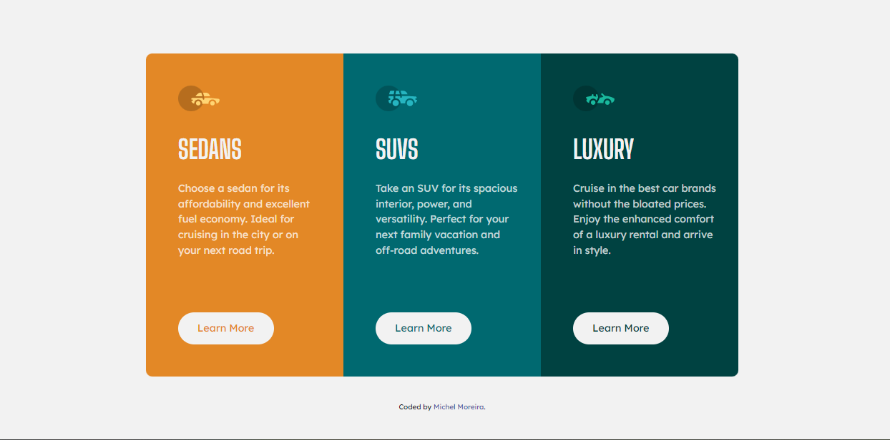

# Frontend Mentor - 3-column preview card component solution

This is a solution to the [3-column preview card component challenge on Frontend Mentor](https://www.frontendmentor.io/challenges/3column-preview-card-component-pH92eAR2-).

## Table of contents

- [Overview](#overview)
  - [The challenge](#the-challenge)
  - [Screenshot](#screenshot)
  - [Links](#links)
- [My process](#my-process)
  - [Built with](#built-with)
  - [What I learned](#what-i-learned)
- [Author](#author)
- [Acknowledgments](#acknowledgments)

## Overview

### The challenge

Users should be able to:

- View the optimal layout depending on their device's screen size
- See hover states for interactive elements

### Screenshot



- Mobile


### Links

- Solution URL: [Add solution URL here](https://your-solution-url.com)
- Live Site URL: [Add live site URL here](https://your-live-site-url.com)

## My process

### Built with

- Semantic HTML5 markup
- CSS custom properties
- Flexbox
- CSS Grid
- Mobile-first workflow
- CSS variables

### What I learned

- That project made me learn about semantic HTML5

- Working with flexible display using the flexbox properties, positioning elements on the screen.

- Working with two-dimensional grid system display using the Grid properties, positioning elements on the screen.

- Working with external fonts (Google fonts) to improve a better custom apparence.

- Working with separated documents, improving organization and responsability to every document with its function in the whole project.

```html
<link rel="stylesheet" href="src/styles/reset.css" />
<link rel="stylesheet" href="src/styles/variables.css" />
<link rel="stylesheet" href="src/styles/style.css" />
<link rel="stylesheet" href="src/styles/responsive.css" />
```

- Working with variables reducing the code and establishing a pattern easiest to manage.

```CSS
:root {
  --first-card: hsl(31, 77%, 52%);
  --second-card: hsl(184, 100%, 22%);
  --third-card: hsl(179, 100%, 13%);

  --white-paragraphs: hsla(0, 0%, 100%, 0.75);
  --background-headings-buttons: hsl(0, 0%, 95%);
  --paragraph: "Lexend Deca", sans-serif;
  --heading: "Big Shoulders Display", cursive;
}
```

## Author

- Github - [Michel Moreira](https://github.com/michel-moreira)
- Frontend Mentor - [@michel-moreira](https://www.frontendmentor.io/profile/michel-moreira)
- LinkdIn - [Michel Moreira](https://www.linkedin.com/in/michel-moreira-760142254/)

## Acknowledgments

To the team of users from the Frontend Mentor that helped me with useful suggestions and feedbacks, promoting an excitement and happiness in the matter of coding. To my personal sponsors (family and friends). To everybody that love coding my whole gratitude.
